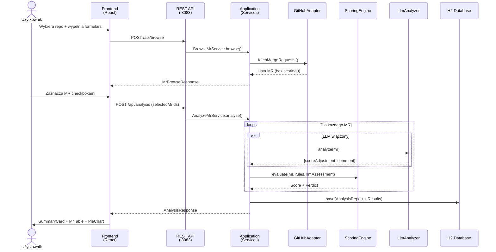
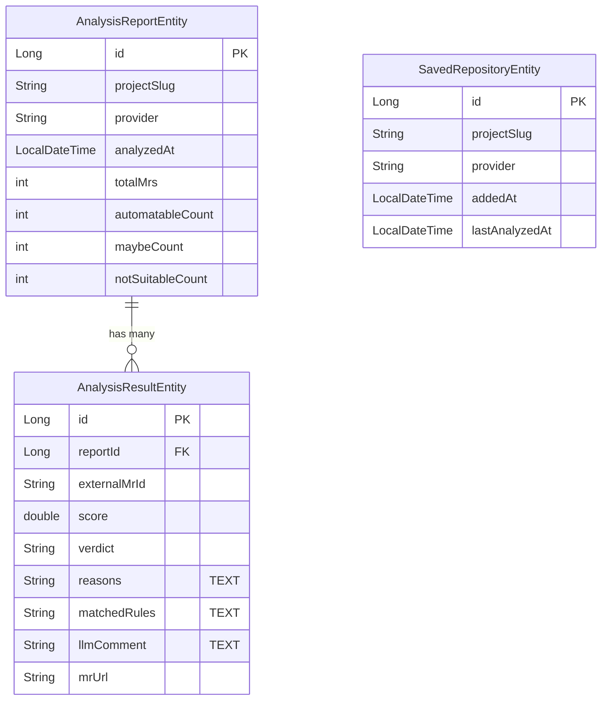

# MR Analizer — diagram architektury

> **TL;DR:** Diagramy Mermaid pokazujące architekturę heksagonalną MR Analizer — warstwy domain/application/adapter, porty, adaptery i przepływ danych. Renderują się natywnie w MkDocs.

## Diagram komponentów (architektura heksagonalna)

```mermaid
graph TB
    subgraph Frontend["🖥️ Frontend — React 18 + TypeScript"]
        DashboardPage
        MrDetailPage
        AnalysisForm
        MrBrowseTable
        MrTable
        VerdictPieChart
        RepoSelector
        AxiosClient["analysisApi<br/>(Axios)"]
    end

    subgraph AdapterIN["📥 Adapter IN — REST API :8083"]
        AnalysisCtrl["AnalysisRestController<br/>/api/analysis"]
        BrowseCtrl["BrowseRestController<br/>/api/browse"]
        RepoCtrl["RepoRestController<br/>/api/repos"]
        ExcHandler["GlobalExceptionHandler"]
    end

    subgraph Application["⚙️ Application — Use Cases"]
        AnalyzeMrSvc["AnalyzeMrService"]
        BrowseMrSvc["BrowseMrService"]
        ResultsSvc["GetAnalysisResultsService"]
        ReposSvc["ManageReposService"]
    end

    subgraph Domain["🟢 Domain — Czysta logika biznesowa"]
        subgraph Models["Modele"]
            MergeRequest
            AnalysisResult
            AnalysisReport
            Verdict
            FetchCriteria
        end
        subgraph Scoring["Scoring Engine"]
            ScoringEngine
            ScoringConfig
            PromptBuilder
        end
        subgraph Rules["Reguły"]
            ExcludeRule
            BoostRule
            PenalizeRule
        end
        subgraph PortsIN["Porty IN"]
            AnalyzeMrUC(["AnalyzeMrUseCase"])
            BrowseMrUC(["BrowseMrUseCase"])
            ResultsUC(["GetAnalysisResultsUseCase"])
            ReposUC(["ManageReposUseCase"])
        end
        subgraph PortsOUT["Porty OUT"]
            MrProvider(["MergeRequestProvider"])
            LlmAnalyzer(["LlmAnalyzer"])
            ResultRepo(["AnalysisResultRepository"])
            SavedRepo(["SavedRepositoryPort"])
        end
    end

    subgraph AdapterGH["📤 Adapter OUT — GitHub"]
        GitHubAdapter
        GitHubClient["GitHubClient<br/>(WebClient)"]
        GitHubMapper
    end

    subgraph AdapterLLM["📤 Adapter OUT — LLM"]
        ClaudeCliAdapter["ClaudeCliAdapter<br/>(ProcessBuilder)"]
        NoOpLlmAdapter
    end

    subgraph AdapterDB["📤 Adapter OUT — Persistence"]
        JpaResults["JpaAnalysisResultRepository"]
        JpaRepos["JpaSavedRepositoryAdapter"]
        H2[("H2 file-based<br/>./data/mranalizer")]
    end

    GitHubAPI(["☁️ GitHub API"])
    ClaudeCLI(["☁️ Claude CLI"])

    %% Frontend → REST
    DashboardPage & MrDetailPage & AnalysisForm & MrBrowseTable & RepoSelector --> AxiosClient
    AxiosClient -->|HTTP| AnalysisCtrl & BrowseCtrl & RepoCtrl

    %% REST → Use Cases
    AnalysisCtrl --> AnalyzeMrUC & ResultsUC
    BrowseCtrl --> BrowseMrUC
    RepoCtrl --> ReposUC

    %% Use Cases implementują porty IN
    AnalyzeMrSvc -.->|implements| AnalyzeMrUC
    BrowseMrSvc -.->|implements| BrowseMrUC
    ResultsSvc -.->|implements| ResultsUC
    ReposSvc -.->|implements| ReposUC

    %% Use Cases → porty OUT
    AnalyzeMrSvc --> MrProvider & LlmAnalyzer & ResultRepo
    AnalyzeMrSvc --> Scoring & Rules
    BrowseMrSvc --> MrProvider
    ResultsSvc --> ResultRepo
    ReposSvc --> SavedRepo

    %% Adaptery implementują porty OUT
    GitHubAdapter -.->|implements| MrProvider
    GitHubAdapter --> GitHubClient --> GitHubMapper
    ClaudeCliAdapter -.->|implements| LlmAnalyzer
    NoOpLlmAdapter -.->|implements| LlmAnalyzer
    JpaResults -.->|implements| ResultRepo
    JpaRepos -.->|implements| SavedRepo
    JpaResults & JpaRepos --> H2

    %% Zewnętrzne
    GitHubClient -->|"REST API<br/>(GITHUB_TOKEN)"| GitHubAPI
    ClaudeCliAdapter -->|"timeout 60s"| ClaudeCLI
```



## Reguły scoringu

Każdy PR startuje z **base score = 0.5**. Reguły modyfikują wynik. Finalny verdict:

| Verdict | Próg score |
|---------|-----------|
| AUTOMATABLE | >= 0.7 |
| MAYBE | >= 0.4 |
| NOT_SUITABLE | < 0.4 |

Formuła: `score = clamp(0.5 + sumaReguł + llmAdjustment, 0.0, 1.0)`

### Exclude (natychmiastowa dyskwalifikacja → score = 0.0)

| Reguła | Warunek | Konfiguracja |
|--------|---------|--------------|
| exclude-by-labels | PR ma label z listy wykluczeń | `hotfix`, `security`, `emergency` |
| exclude-by-min-changed-files | Za mało zmienionych plików | min: 2 |
| exclude-by-max-changed-files | Za dużo zmienionych plików | max: 50 |
| exclude-by-file-extensions-only | Wszystkie pliki to config | `.env`, `.yml`, `.toml`, `.lock` |

### Boost (podniesienie score)

| Reguła | Waga | Warunek | Konfiguracja |
|--------|------|---------|--------------|
| boost-by-title-keywords | +0.20 | Tytuł/opis zawiera słowo kluczowe | `refactor`, `cleanup`, `add test`, `rename` |
| boost-by-has-tests | +0.15 | PR zawiera pliki testowe | — |
| boost-by-changed-files-range | +0.10 | Liczba plików w „sweet spot" | [3, 15] |
| boost-by-labels | +0.15 | PR ma label z listy boost | `tech-debt`, `refactoring`, `chore` |

### Penalize (obniżenie score)

| Reguła | Waga | Warunek | Konfiguracja |
|--------|------|---------|--------------|
| penalize-by-large-diff | -0.20 | Diff (additions+deletions) > próg | 500 linii |
| penalize-by-no-description | -0.30 | Brak opisu PR | — |
| penalize-by-touches-config | -0.10 | PR dotyka plików konfiguracyjnych | `.yml`, `.yaml`, `.toml`, `.env`, `.properties`, `.xml`, `.json` |

### LLM (opcjonalnie)

Claude CLI może dodać `scoreAdjustment` w zakresie **-0.5 do +0.5** z komentarzem uzasadniającym.

### Przykład kalkulacji

```
PR: tytuł "refactor auth service", 8 plików, testy, 600 linii diff, brak opisu

  base score                         0.50
+ boost-by-title-keywords (refactor) +0.20
+ boost-by-has-tests                 +0.15
+ boost-by-changed-files-range [3,15]+0.10
- penalize-by-large-diff (600>500)   -0.20
- penalize-by-no-description         -0.30
                                     ─────
  Final score                        0.45 → MAYBE
```

## Diagram przepływu analizy



## Diagram encji (baza danych)


