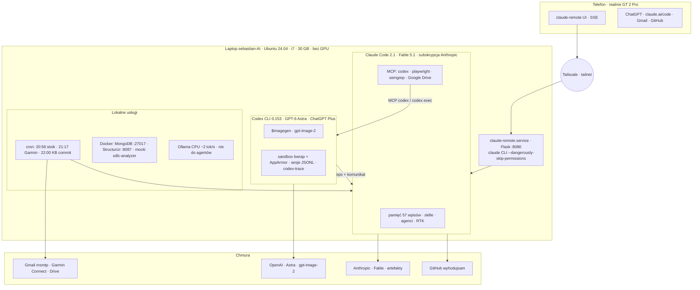
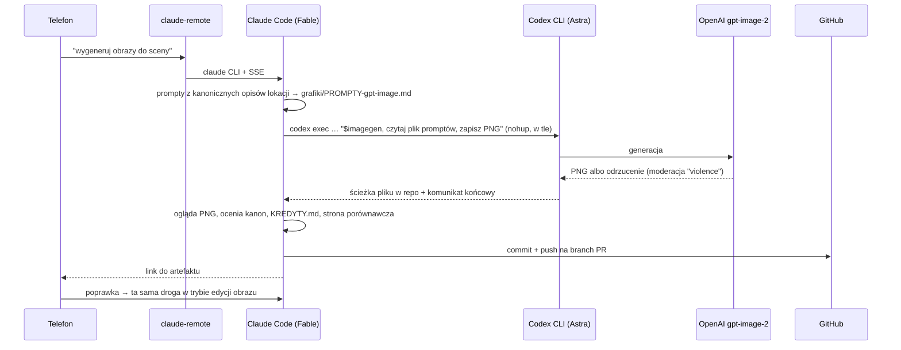

# Stanowisko AI: architektura i przepływy

> **TL;DR:** Jeden laptop (sebastian-AI) pod agentów, dwie subskrypcje (Anthropic → Claude Code z Fable 5.1, ChatGPT Plus → Codex CLI z GPT-6 Astra), telefon jako pilot przez Tailscale i claude-remote. Claude Code jest orkiestratorem i pamięcią, Codex dostaje samowystarczalne zlecenia w plikach (trudne zadania, druga opinia, obrazy). Wersja graficzna: [schemat interaktywny](stanowisko-ai-schemat.html) (stan na 2026-09-07).

## Warstwy

## Zasada podziału pracy

- **Claude Code (Fable):** kontekst, decyzje, redakcja, korekta, pamięć trwała, git i PR-y. Subagenci (Redaktor, Korektor, reviewerzy) też na Fable.
- **Codex (Astra):** zadania trudne albo wymagające niezależnej weryfikacji, drugi Pisarz w książce 1413, generowanie i edycja obrazów. Nie widzi sesji Claude, więc zlecenie zawsze jako samowystarczalny plik w repo.
- **Telefon:** nie liczy nic sam. Prompt → Tailscale → claude-remote → `claude` CLI; odpowiedź strumieniem SSE; wyniki do czytania jako artefakty HTML na claude.ai/code.
- **Limity Plusa:** jedna pula dla Astry, obrazów i aplikacji ChatGPT (okno 5 h + tydzień). Przed dużym zleceniem: `codex-trace` pokazuje linię LIMITY.

## Przepływ A: obraz do sceny książki

Koszt: ok. 3–4% okna 5 h na obraz. Kadry po walce i pogrzeb są odrzucane, przechodzi tylko statyczny kadr bez kontaktu.

## Przepływ B: scena z Astrą jako Pisarzem

1. **Fable, etap 0:** brief (funkcja, kanon, twarde ograniczenia z gotowej prozy), tło, zlecenie z listą plików do przeczytania w kolejności i notą „mniej sarkazmu".
2. **Fable → Codex:** `codex exec -m gpt-6-astra -c 'model_reasoning_effort="high"' -o wynik.md` w tle.
3. **Astra:** czyta ~20 plików kanonu, pisze draft 5–6 tys. słów (18 min, 2,9 M tokenów in, ~55% okna 5 h).
4. **Subagent Redaktor (Fable):** kanon, rejestr, dramaturgia, powtórzenia; raport zmian i punkty do decyzji autora.
5. **Subagent Korektor (Fable):** tylko język; pewne poprawki naniesione, wątpliwe zostawione.
6. **Fable:** wersja końcowa do `tekst/`, rejestry, strona diff draft ↔ finał, branch + PR.
7. **Telefon:** czytanie porównania, decyzje autora jako kolejne prompty; `/1413-audyt` przed merge.

## Gotchas

- Ubuntu 24.04 blokuje userns dla bwrap: profil `/etc/apparmor.d/bwrap`, po aktualizacji systemu `sudo apparmor_parser -r`.
- `codex exec` wymaga katalogu w repo git (`-C`), domyślny reasoning effort to `none`.
- Skrypty w tle kończyć `exit 0`, inaczej Claude Code raportuje błąd przy pustym `grep -c`.
- Obrazy lądują w `~/.codex/generated_images/`, skill potrafi przenieść je do repo.

Powiązane: [claude-remote](../aplikacje/claude-remote.md), [Structurizr](../aplikacje/structurizr.md).
